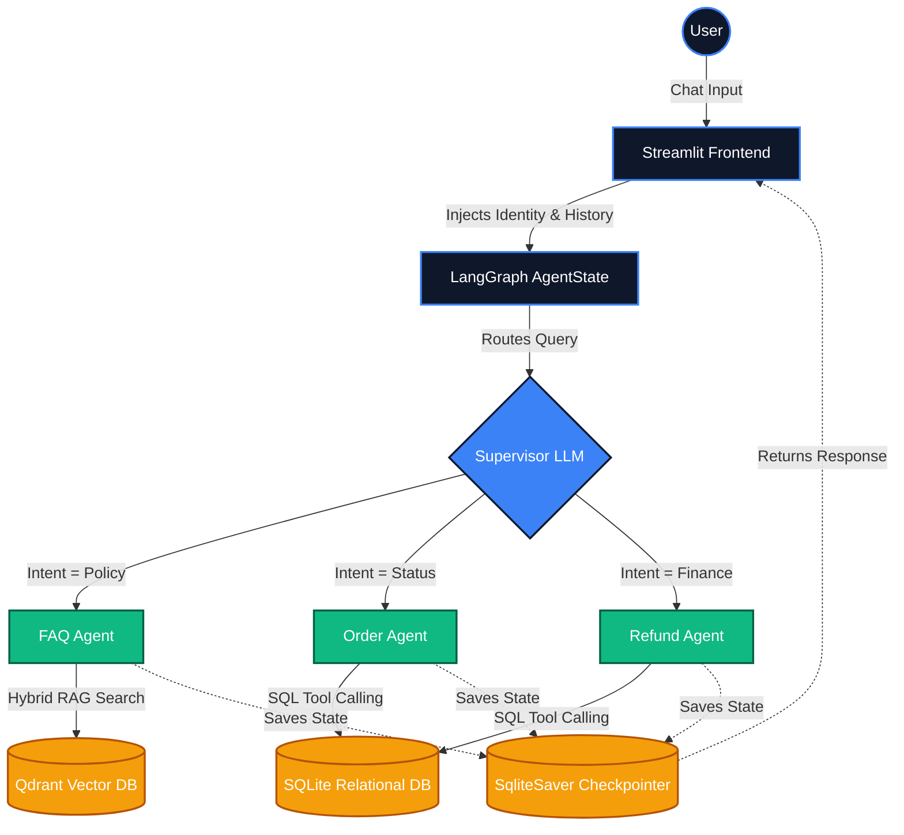

# Business and Software Requirements Document (BRD/SRS)
**Project Name:** NovaShop AI Support Supervisor
**Version:** 1.0
**Date:** July 2026

---

## 1. Executive Summary
The NovaShop AI Support Supervisor is an enterprise-grade, multi-agent customer support system. It leverages large language models (LLMs) orchestrated via a StateGraph architecture to semantically route user queries to specialized sub-agents. It securely queries internal relational databases for structured data (Orders, Refunds) and utilizes Hybrid RAG (Retrieval-Augmented Generation) for unstructured policy data, providing an autonomous, highly accurate, and conversational support experience.

## 2. Business Objectives
- **Reduce Support Ticket Volume:** Automate 80%+ of Tier-1 support inquiries related to order tracking, refund requests, and policy FAQs.
- **24/7 Availability:** Provide instantaneous, natural-language support at any hour without human staffing constraints.
- **Secure Data Access:** Ensure customers can only query and manipulate data tied explicitly to their authenticated identity (Role-Based Access Control).
- **Scalable Architecture:** Establish a decoupled multi-agent framework where new specialized agents (e.g., Technical Support, Billing) can be added to the orchestration layer without rewriting the core routing logic.

## 3. Project Scope
### In-Scope
- Web-based chat interface.
- Authentication portal with hardcoded RBAC (Customer vs. Admin).
- Semantic router (Supervisor LLM).
- Three specialized worker agents: FAQ, Order Management, and Refund Processing.
- Persistent session state (Long-Term Memory).
- Integration with local SQLite (structured data) and Qdrant (vector data).

### Out-of-Scope
- Live human agent handoff via real-time websockets (escalations currently just update a database flag).
- OAuth2/SSO integration (currently relies on basic session simulation).
- E-commerce frontend storefront integration.

---

## 4. Technology Stack
- **Frontend / Presentation:** Streamlit (Python UI Framework)
- **Agent Orchestration:** LangGraph (StateGraph, Checkpointing, ToolNodes)
- **LLM Framework:** Langchain Core, Langchain Groq (or local Ollama fallbacks)
- **Core LLM:** Llama-3.1-8B-Instruct (via Groq API)
- **Vector Database (Unstructured Data):** Qdrant (Local instance)
- **Embeddings:** HuggingFace `all-MiniLM-L6-v2` (SentenceTransformers)
- **Sparse Indexing:** BM25 (for Hybrid RAG Keyword Search)
- **Relational Database (Structured Data):** SQLite3 (DB-API)
- **State Persistence:** `langgraph-checkpoint-sqlite` (SQLite WAL mode)

---

## 5. User Roles & Permissions (RBAC)
| Role | Permissions & Access Scope |
| :--- | :--- |
| **Customer** | Can read personal order status. Can request refunds for eligible personal orders. Cannot access other users' data. |
| **Admin** | Has global access. Can look up any customer's orders. Bypasses identity constraints. |

---

## 6. Functional Requirements
**FR1: Authentication & Identity Management**
- The system must require users to log in with a valid username and password.
- The system must extract the authenticated user's `Name`, `Role`, and `Customer ID` and inject it dynamically into the LangGraph `AgentState` as an immutable variable (`customer_context`).
- The LLM must acknowledge and utilize this injected identity natively.

**FR2: Semantic Routing**
- The system must feature a Supervisor node that intercepts raw user input.
- The Supervisor must evaluate the intent and route the message to one of three conditional edges (`faq`, `order`, `refund`).
- The Supervisor must not attempt to answer the query itself.

**FR3: FAQ Retrieval (Unstructured Data)**
- The FAQ Agent must utilize a Hybrid Search algorithm.
- It must query the Qdrant vector database for semantic similarity and the BM25 index for exact keyword matches, fusing the results via Reciprocal Rank Fusion (RRF).
- The agent must strictly answer using ONLY the retrieved context.

**FR4: Database Operations (Structured Data)**
- The Order and Refund Agents must be equipped with `@tool` bound Python functions.
- The AI must output JSON function calls containing parameters (e.g., `order_id`).
- The Python tools must execute parameterized SQL queries against the SQLite database and return raw JSON rows to the LLM.
- The Refund tool must enforce an eligibility check (e.g., rejecting refunds past the 30-day window) before updating the database.

**FR5: Persistent Memory**
- The system must capture the absolute state of the graph (messages, tool outputs) at the end of every turn.
- State must be serialized into an SQLite checkpointer keyed to the user's `thread_id`.
- The system must deduplicate history arrays by message ID.

---

## 7. Non-Functional Requirements
**NFR1: Performance & Latency**
- RAG Retrieval (Vector + Sparse) must execute in under 200ms.
- LLM Token Generation (via Groq API) must sustain >300 tokens per second.
- Database reads/writes must utilize WAL (Write-Ahead Logging) to prevent UI blocking.

**NFR2: Security & Privacy**
- **Data Isolation:** SQL queries executed by tools MUST automatically append a `WHERE customer_id = ?` clause utilizing the session's injected `customer_id` (unless the user role is Admin) to prevent lateral data access.
- **Prompt Injection Defense:** The `customer_context` variable must override standard LLM PII filters, heavily instructing the model to trust the hardcoded identity parameters over user-supplied identity claims.
- SQL queries must be parameterized to prevent SQL injection attacks.

**NFR3: Reliability & Data Integrity**
- The Long-Term Memory checkpointer must run in thread-safe SQLite `-wal` and `-shm` mode to prevent database locking during concurrent session writes.

---

## 8. System Architecture Flow
1. **[User Input]** User submits query via Streamlit UI.
2. **[State Hydration]** Streamlit packages the query alongside the session `customer_context` and passes it to the `AgentState`.
3. **[Routing]** Supervisor LLM evaluates intent -> Routes to specific worker.
4. **[Execution]**
   - *If FAQ:* Triggers Hybrid Search against Qdrant.
   - *If Order/Refund:* LLM pauses -> Triggers Python Tool -> Executes SQLite Query -> Returns data to LLM.
5. **[Synthesis]** Worker agent synthesizes final natural language response.
6. **[Persistence]** The entire sequence is serialized into `novashop_memory.db` by the `SqliteSaver`.
7. **[Output]** Streamlit UI streams the final response to the user.

### Architecture Diagram

